# Lab Report 1
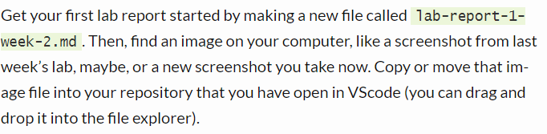


## Installing VScode 
---
Go to the following link and follow the instructions to download [Visual Studio Code](https://code.visualstudio.com/) for your operating system. 


After VS Code is installed, you should be able to start VS Code and arrive a window that looks similar to the picture shown below.

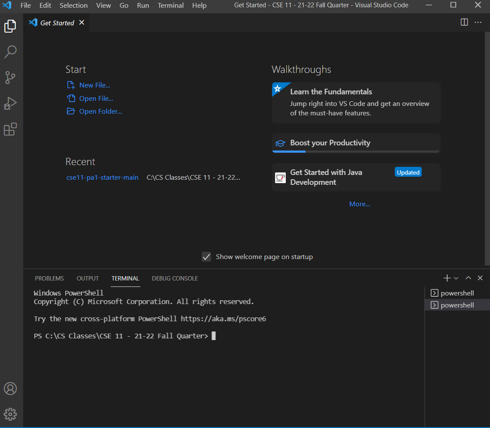
  
  

## Remotely Connecting
---
If you are on Windows, you must first install the OpenSSH client which can be found by going to Windows' Settings > Apps & Features > Optional Features 

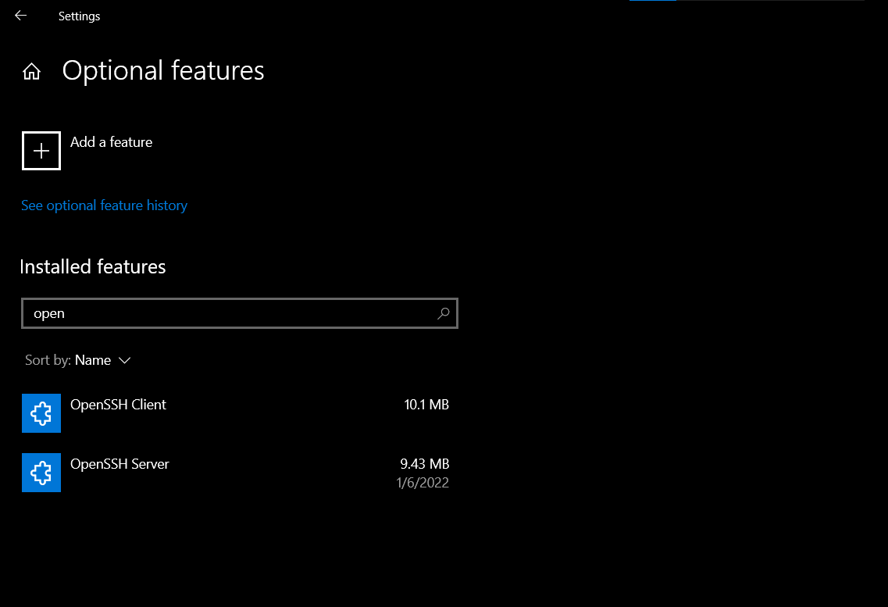

Then look up your [account](https://sdacs.ucsd.edu/~icc/index.php) for CSE15L.


In Visual Studio Code, enter the following command in a terminal with the brackets replaced with the corresponding letters in your account:
```
$ ssh cs15lwi22[]@ieng6.ucsd.edu
```

If it is your first time connecting to this server, you'll likely get a message asking if you want to continue connecting. Type in `yes`, hit enter, and type in and enter your password. Your terminal should then look something like the following image along with the lines about the previously mentioned message:
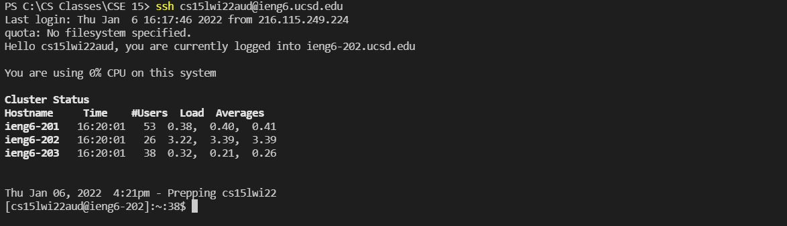

## Trying Some Commands
---
Now that you are connected to the server, you can try out various commands and see what they do. Here are some you can try out:
- cd ~
- cd
- ls -lat
- ls -a
- cp /home/linux/ieng6/cs15lwi22/public/hello.txt ~/
- cat /home/linux/ieng6/cs15lwi22/public/hello.txt

Running `cd ssh` for instance moves the directory that you're in.
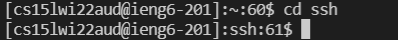

Running `ls` prints out all the files and folders within the directory that you're in.
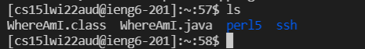

You can also enter the command `exit` to log out of the remote server.  
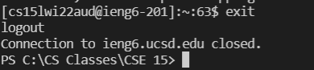

## Moving Files with scp
---
First create a file on your computer called WhereAmI.java with the following code:
```
class WhereAmI {
  public static void main(String[] args) {
    System.out.println(System.getProperty("os.name"));
    System.out.println(System.getProperty("user.name"));
    System.out.println(System.getProperty("user.home"));
    System.out.println(System.getProperty("user.dir"));
  }
}
```
Running it with `java` and `javac` on your computer will give you details about your own computer like:  
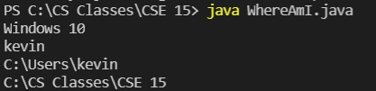

Next, in the same terminal in the directory where you created the file, run the following command with your own username (in place of the brackets):  
`scp WhereAmI.java cs15lwi22[]@ieng6.ucsd.edu:~/`

If you then connect to the server like before and enter `ls`, the WhereAmI.java file should be there. While connected to the server, you can then run `java` and `javac` and it will run on the server's computer.
  
  
## Setting an SSH Key 
---
The following instructions are designed for [Windows](https://docs.microsoft.com/en-us/windows-server/administration/openssh/openssh_keymanagement#user-key-generation). 
On your computer, enter the following command to generate an SSH key:  
`ssh-keygen -t ed25519`  
Hit enter twice to save the file with no passphrase. Your terminal should look something like this:
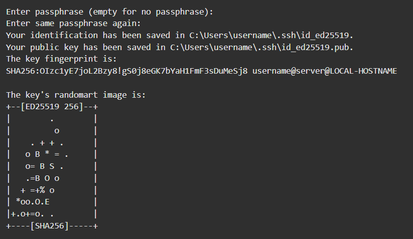  
Then enter the following commands:
```
Start-Service ssh-agent
ssh-add []
```
The brackets should be replaced with the location of the private ssh key (without .pub). It can be found on the line "Your identification has been saved in..."  
  
Next run the following command to copy the public ssh key (the one ending in .pub) to the server with the brackets replaced with the location of the public key (location found on the line below where the terminal printed the private key location):  
`scp [] cs15lwi22@ieng6.ucsd.edu:~/.ssh/authorized_keys`  
  
Now you should be able to run `ssh` or `scp` without entering your password.


## Optimizing Remote Running
---

Using quotes (""), semi-colons (;), and the up and down arrow keys can help you optimize your time spent running and testing programs remotely. The arrow keys will cycle through your most recently entered commands in reverse chronological order.  

Quotes can used in conjunction with `ssh` to run a command on the server and immediately disconnect:
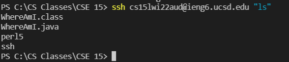  

Semi-colons can be used to run serveral commands using the same line:  
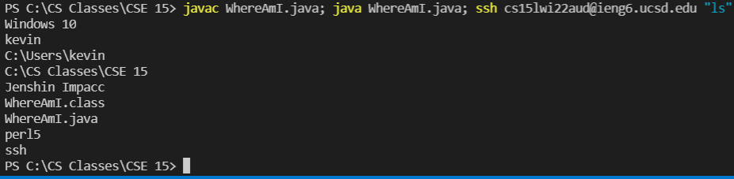  

If you want to run multiple commands directly on the server, use semi-colons within quotes:
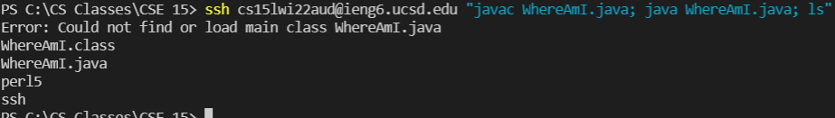  
The command shown in the picture runs the following three commands on the server directly before disconnecting:  
```
javac WhereAmI.java
java WhereAmI.java
ls
```

Putting everything together, you can edit, save, and run a program remotely by: 

1. Prewrite `scp [File Name].java cs15lwi22[]@ieng6.ucsd.edu:~/; ssh cs15lwi22[]@ieng6.ucsd.edu "javac [File Name].java; java [File Name]` with the parts in brackets replaced with the file you want to run or your username in the account on a seperate text document.
2. Save the file with Ctrl + s (2 keypresses)
3. Click on the text document with the command
4. Click and highlight the command.
5. Copy via Ctrl + c (2 keypresses).
6. Click on VS Code.
7. Click on the terminal to shift focus.
8. Paste via Ctrl + v (2 keypresses)
9. Press enter to run the command.

The initial command that you need to write will vary the amount of keypresses needed depending on the number of files, whether you want to run it remotely, etc, but the steps afterwards take 11 keypresses/mouse clicks. Additionally, if you need to run the program again (after another edit & save), you can use the Up and Down arrow keys to bring up the command you just used:
1. Click on the terminal to shift focus to it.
2. Tap the Up arrow key to get back to the original command (best case adds 1 keypress, worst case adds way more than the first method)
3. Press enter to run the command. 

Thus, if you've already used the command once, you can get the process down to 3 keypresses/mouse clicks.


