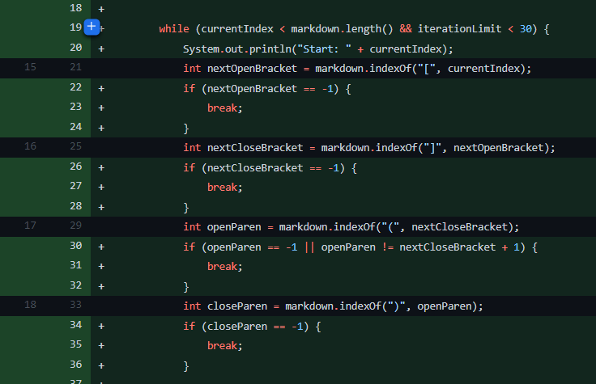
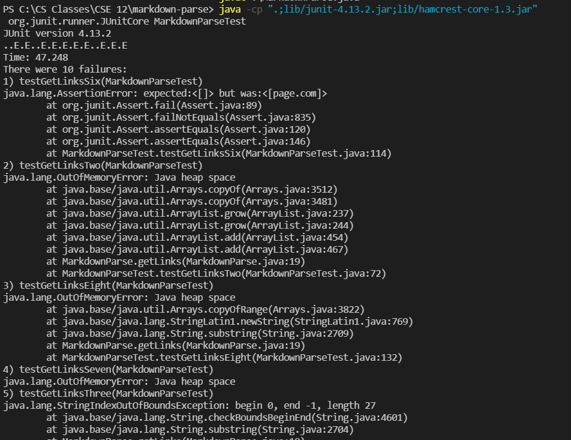
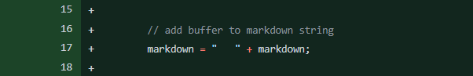
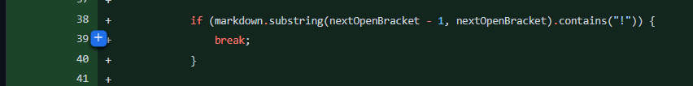
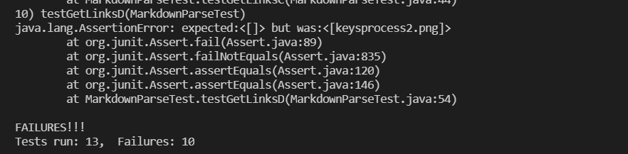
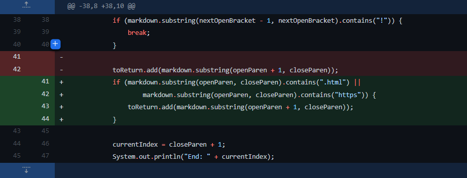
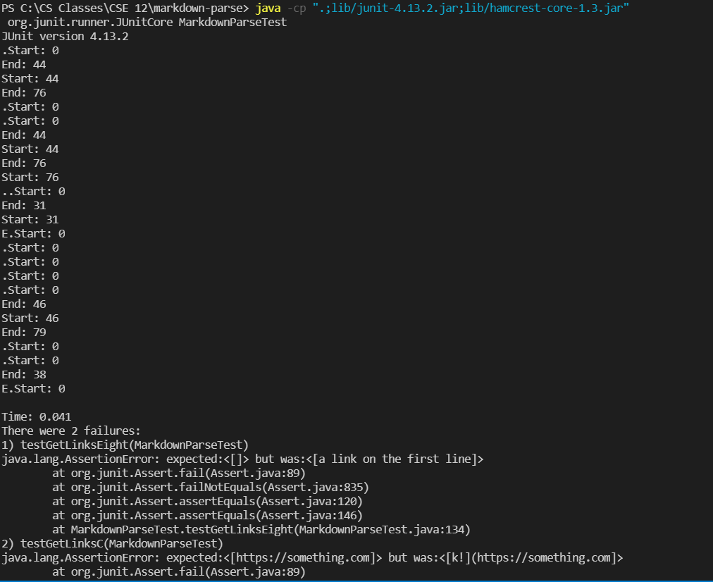

# Lab Report 2

## Code Change 1 
---

[Test 3](https://github.com/potato48/markdown-parse/blob/main/test-file3.md) broke this version of the program (would run into an infinite loop).

The bug was that the indexOf calls for the parentheses and brackets would return -1 if the next one couldn't be found; however, currentIndex would keep being set to that returned value. As a result, the while loop would never end, and the program would keep on running. With ``test-file3.md``, tehre are no parentheses after the brackets, so the indexOf calls that search for parentheses would return -1, currentIndex would be set to that value, and the while loop would keep running.
## Code Change 2 
---

[Test D](https://github.com/potato48/markdown-parse/blob/main/test-fileD.md) broke this version of the program (would add the path/URL of an image element).

The bug was originally that the code would pick up URLs containing ``https`` but not paths. This was done to prevent it from picking up images. Without the new change or the old check, the program would add the URLs/paths used in image elements which have extremely similar syntax to link elements (2 parentheses and 2 brackets, but images have an exclamation mark). With ``test-fileD.md``, the code would see no difference between the image element's syntax and a link element's syntax, so it would add ``keysprocess2.png`` to the list of links despite it not being an actual link.

## Code Change 3
---

[Test 8](https://github.com/potato48/markdown-parse/blob/main/test-file8.md) broke this version of the program (added the contents of a link element, but the link is invalid).

This bug sprang up as a result of trying to fix the bug fixed by Code Change 2. The original check only considered if the part inside parentheses had ``https``, however, that didn't include paths which are valid links, so a check needed to include both URLs and paths while rejecting everything else. With ``test-file8.md``, the string between the brackets: ``a link on the first line`` isn't a valid link, so it shouldn't be included. Without any check, the string gets added to the list of links.

