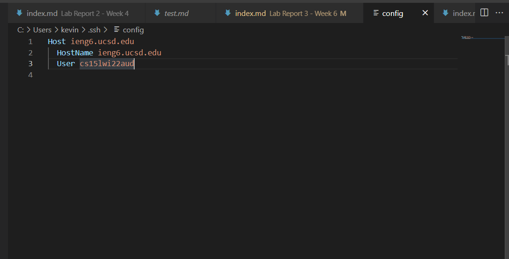
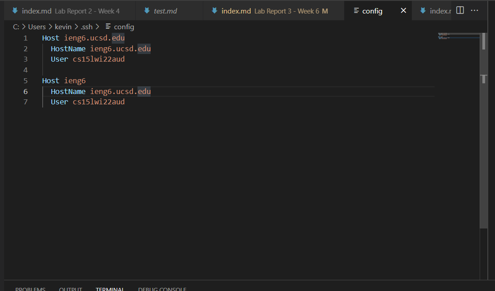
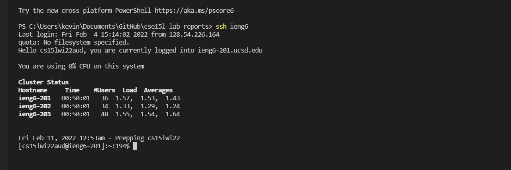
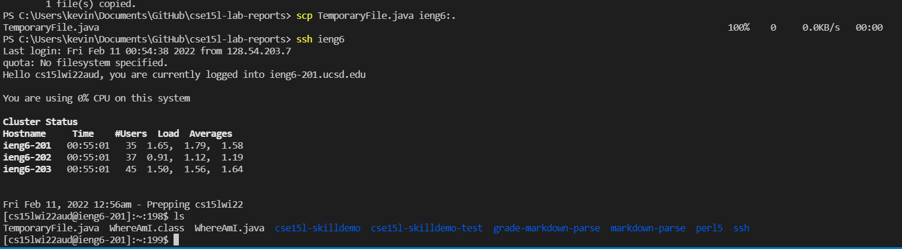

# Lab Report 3

## Streamlining ssh Configuration 
 
Previously, there was one other alias in my config file that, in effect, let me leave out my username when using the `ssh` command. 

  

I edited this file by finding it and opening it in VScode. I added a new alias which lets me use just `ssh ieng6` to login. The HostName `ieng6.ucsd.edu` is the domain that I'm trying to connect to to access the CSE labs remotely. `cs15lwi22aud` is my username.

 

 
Above is an image of me remotely logging in using the new alias I added to the config file. In total, it saves 22 keyboard presses which is a pretty good time save, and it's easier to remember. 

 

 
Above is an image of me using the new alias to `scp` a file onto my account. Similar to using the alias with `ssh`, it saves a decent amount of keyboard presses.

