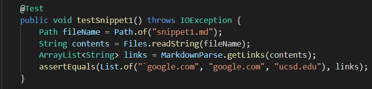
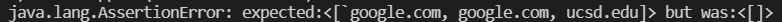
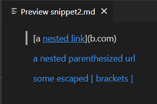
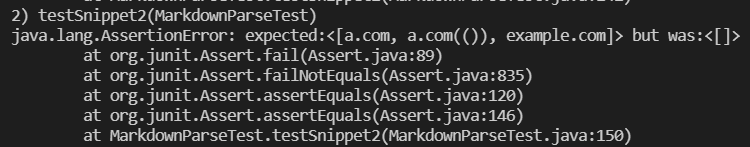
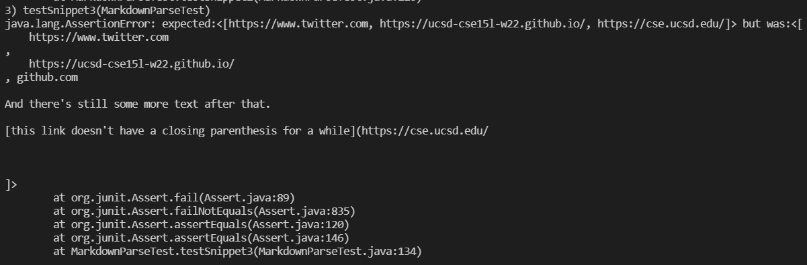
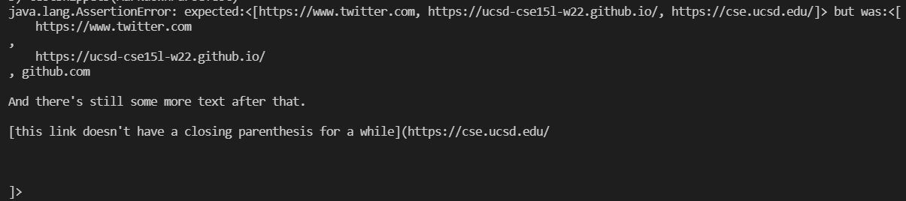

# Lab Report 4

## Snippet/Test 1
### **Expected result:** ``[`google.com, google.com, ucsd.edu]``

### **Test implementation:**

### **My Implementation:**
Total Output For Snippet 3: 

Specific Line: 

The AssertionError indicates that there was a difference between what was expected and what the actual result was.

### **Reviewed Implementation:**
Total Output For Snippet 3: 

Specific Line: 

The AssertionError again indicates that there was a difference between what was expected and what the actual result was.

 

---

 

## Snippet/Test 2

### **Expected result:** ``[a.com, a.com(()), example.com]``

### **Test implementation:**

### **My Implementation:**
Total Output For Snippet 3: 

Specific Line: 

The AssertionError indicates that there was a difference between what was expected and what the actual result was.

### **Reviewed Implementation:**
Total Output For Snippet 3: 

Specific Line: 

The AssertionError again indicates that there was a difference between what was expected and what the actual result was.

 

---

 

## Snippet/Test 3

### **Expected result:** ``[https://www.twitter.com, https://ucsd-cse15l-w22.github.io/, https://cse.ucsd.edu/]``

### **Test implementation:**

### **My Implementation:**
Total Output For Snippet 3: 

Specific Line: 

The AssertionError indicates that there was a difference between what was expected and what the actual result was.

### **Reviewed Implementation:**
Total Output For Snippet 3: 

Specific Line: 

The AssertionError again indicates that there was a difference between what was expected and what the actual result was.

 

---

 

## Potential Code Changes

### Snippet 1
No, the current issue with my version of `MarkdownParse.java` is that there are checks to try and see if the URL is valid that are too restrictive, but removing them causes other tests to fail. The way that that if then statement's condition is checked would need to be reworked on top of how backticks are handled in general. Right now, `MarkdownParse` isn't checking for inline code/backticks at all.

### Snippet 2
No, a more involved change would be needed as my current version of `MarkdownParse`'s way of searching for the closing character of each parenthese and bracket does not work for most nested cases. Fixing the code would require redoing all of that (>15 lines either changed or completely replaced) and writing separate helped methods would likely be needed to keep the getLinks method from getting too large/messy. 

### Snippet 3
A small code change would likely be enough to deal with newlines themselves as the substring of `markdown` that is about to be added to `toReturn` could have all newline characters (\n) deleted in a similar way to how whitespace might be deleted. The test for snippet 3 also fails for my implementation of `MarkdownParse.java` because of incorrectly searching for closing parentheses. This might take a code change greater than 10 lines, similar to how snippet 2 might be fixed.